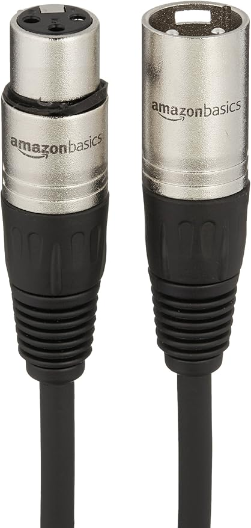

# Cycoupe (Projet Coupe Cyclo)
## Idée
Une course virtuelle qui est controllée par un vrai vélo stationnaire.

## Objectif
Transformer les actions de l'utilisateur dans le vrai monde en actions dans un jeu virtuel. Créer un lien entre ces 2 mondes.

## Synopsis
L'utilisateur s'assit sur le vélo et l'expérience commence, projectée devant lui. Il commence une course aléatoirement choisie. 

L'utilisateur est amené à pédaler avec le vélo pour avancer et finir la course avant sa compétition, d'autres conducteurs controllé par le jeu (CPU).

L'utilisateur peut utiliser le volant devant lui pour franchir les virages et les obstacles qui lui sont présentés. Ce volant aurait plusieur boutons pour ajouter des façons de jouer.

Une tablette serait installée sur le vélo stationnaire pour servir de carte pour que l'utilisateur puissent voir les virages à venir, sa progression (quel tour il est à et le durée présente de la course) et la position de sa compétion.

Ces façons de jouer serait de pouvoir utiliser des pièges aléatoire, gagnés avec des virages long, seré et bien réussi, pour attaquer sa compétition et la dépassé.

À Chaque course gagnée, le joueur gagne une récompense aléatoire, ça peut être un nouveau véhicule (par exemple, un bus) ou un atout (peut être utile, peut être drôle, par exemple, commence la course avec un boost ou contact avec la compétition propulse les deux).

## Scénario

## Références Sonores
- [Voiture](https://pixabay.com/fr/sound-effects/race-care-151963/)
- [Countdown du début de course](https://pixabay.com/fr/sound-effects/countdown-27545/)
- [Objet Obtenu](https://pixabay.com/fr/sound-effects/ui-sci-fi-sound-36061/)

## Moodboard

## Scéranimage

## Illustration des intéractions

## Flux de données

## Équipements
- Vélo Stationnaire
- [Volant](https://a.co/d/fv0kDNg)
- Tablette
- Un bouton
- Projecteur
- [Haut Parleurs](https://images.ctfassets.net/4zjnzn055a4v/1VYmQS2F8SIsBGRFpfTTSN/345f48f9c953239780102787372c0d7b/8040_main_image.jpg)
- [XLR](https://a.co/d/8WLacF8)
- [XLR USB](https://a.co/d/cFtaFkM)

## Plantation
[Plantation](./assets/plantation.jpg)
[Bike](./assets/bike.jpg)
[Screen](./assets/screen.jpg)
[TinyScreen](./assets/tinyScreen.jpg)
[Projector](./assets/projector.jpg)
[Speaker](./assets/graphSpeaker.jpg)

## Circulation des visiteurs
L'utilisateur est amené à s'assoir sur le vélo stationnaire et jouer. Une fois terminé, l'utilisateur est invité à descendre du vélo stationnaire et laisser la place à quelqu'un d'autre. 

## Gestion des câblages
Un point d'alimentation serait simultanément utilisé pour le vélo stationnaire et les haut-parleurs pendant qu'un deuxième point d'alimentation serait utilisé pour le projecteur et l'ordinateur. L'ordinateur serait plugué à la tablette et à l'écran.

## Logiciels
### Production
- Maya 2023
- Photoshop
- Visual Studio Community 2022
- REAPER
- Arduino IDE

### Exposé
- Unity
- Touch Designer

## Références
### Moodboard
- [Minimap](https://d1o0zx25fn5p70.cloudfront.net/y9bq-ZhOrkcM_HD13okJVyUm9lc=/fit-in/1280x800/noupscale/rebuy-akeneo/a/f/b/6/afb62b1a696ede8a66a54d2278ee218dfed80318_asset_1_14436.jpeg?t=0)
- [Vélo](https://www.xtcfitness.ca/cdn/shop/files/life-fitness-upright-bike-c1-life-cycle-go-console-upright-bikes-c1-xx00-0104-gc-000x-0105-72691285-life-fitness-42253736575283.jpg?v=1694557624&width=1000)
- [Jeu de course](https://www.topgear.com/sites/default/files/2021/12/Switch%205%20-%20Grid%20Autosport.jpg)
- [Circuit de Course](https://media.istockphoto.com/id/1156933946/photo/international-race-track.jpg?s=612x612&w=0&k=20&c=1PMCZ35aqdXimlTYz9WE1TF3IA_X_FAI7ObGhqveo7M=)
- [Items](https://www.reddit.com/media?url=https%3A%2F%2Fpreview.redd.it%2Fchanges-i-would-make-to-mario-kart-wiis-item-selection-v0-a3s4232kas1d1.png%3Fwidth%3D1920%26format%3Dpng%26auto%3Dwebp%26s%3Dd68a4a65b00bfa151c529ad5ebeba5d5c5e70e6d)
